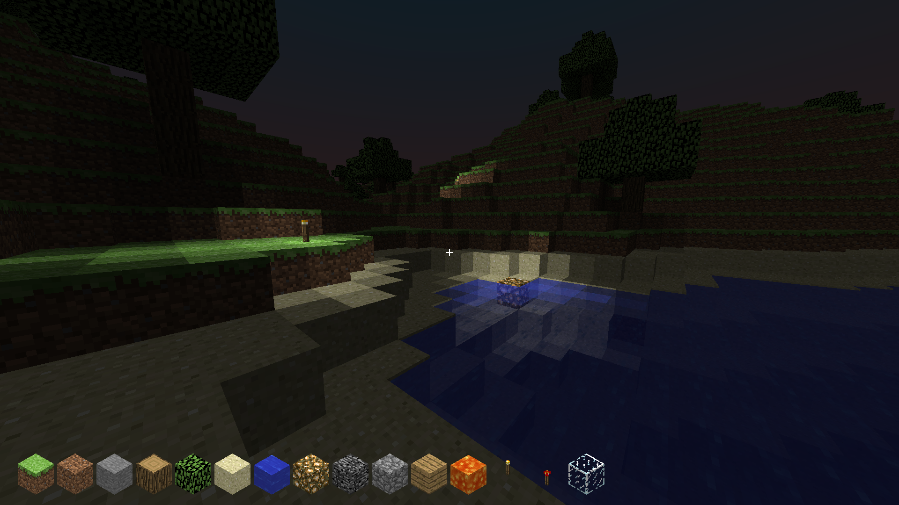

# Minecraft-like Voxel Game
This is my first attempt at a 3D game and my first experience with OpenGL.
It is very Minecraft-like with blocks that can be placed and broken at will.

## Features
- I used batch rendering and chunk meshing to optimize the game.
- Frustum culling (not my implementation) of chunks is used.
- Culling of occluded voxel faces is also implemented.
- Wavey blocks (leaves, water).
- Separate rendering of transparent and opaque voxels.
- Ray traversal voxel selection.
- Variables in the game are very customizable during gameplay through the config GUI.
- Procedural terrain generation
- Recursive lighting, including variable skylight (adjustable in config GUI)

## Todo
- Greedy Meshing by combining block faces of same texture and light value.
- Use a noise algorithm that allows for seeds and more interesting terrain generation.
- A proper GUI system other than ImGUI.
- A proper collision system.
- ~~Make lighting system light each face of a voxel independently.~~ Done ✅

## Installation and Running
- If you for some reason want to install this program, I would recommend installing it on Linux. I have managed to get it running on Windows but it is a pain because it requires MinGW as well as GLFW and OpenGL installed on MinGW. Both must be accessable to the compiler. Posix threads must be enabled in MinGW, because the program uses the mutex header. 
- I have not tried to get it to work on Mac.
- This program requires GLFW and OpenGL on Linux installations as well.
- The only method for installation as of now is building from source. Download the source and run make on the root directory of the source. For best performance, run `make release`. The outputted binary requires that the assets folder be in the root of the current working directory.
You can either copy the assets folder into the bin folder and run from inside the bin folder, or run `bin/release` from the root of the cloned repository so that the assets folder is accessable to the program.

## Controls
The controls are curreltly all over the place. They are as follows:
- Tab - Toggle the cursor 
- F3 - Show the config GUI
- C - Zoom
- W, A, S, D - Movement
- Space - Jump, Fly up (no-clip)
- Shift - Fly down (no-clip)
- Esc - Exit the program
- F - Toggle fullscreen
- Z - Toggle no-clip
- Mouse - Turning, left and right click for breaking and placing
- Middle mouse button - Change block in hand to the block the player is currently looking at
- Scroll - Move through inventory
- 1-9 - Select corresponding block in inventory

## Screenshots

